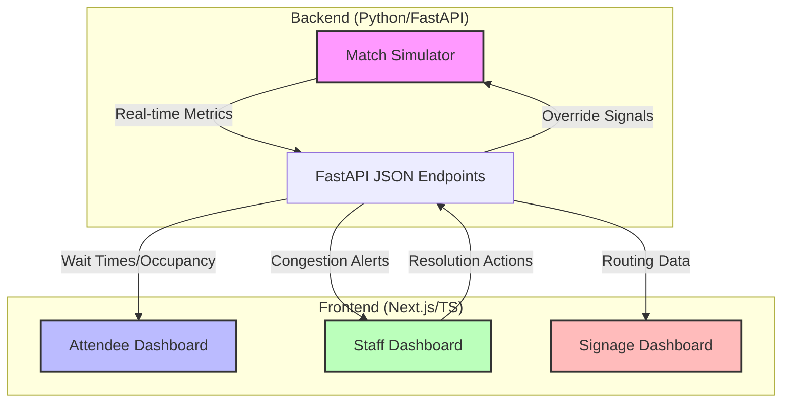

# SmartVenue OS 🏟️

SmartVenue OS is a resilient microservices-based prototype designed to solve real-time stadium congestion and operational challenges. It simulates a high-traffic event (like a soccer match) and provides actionable dashboards for stadium staff and attendees.

## 🗺️ System Architecture

SmartVenue OS operates as a **Cyber-Physical System (CPS)** loop where the virtual simulation drives the physical user experience.



## 🎭 The Three-Dashboard Strategy

The solution is divided into three distinct interfaces, each serving a unique persona in the stadium ecosystem:

1.  **Staff Dashboard (The Command Center)**: 
    - **Persona**: Stadium Operations Manager.
    - **Goal**: Identify and resolve bottlenecks before they turn into safety hazards.
    - **Feature**: Features a live heatmap and "one-click" resolution triggers that override the simulation state.

2.  **Attendee Dashboard (The Personal Assistant)**:
    - **Persona**: Fans and Spectators.
    - **Goal**: Minimize time spent in lines and maximize time watching the event.
    - **Feature**: Real-time wait times for 5+ concessions and "Express Pickup" QR flow.

3.  **Signage Dashboard (The Visual Router)**:
    - **Persona**: Automated Overhead Infrastructure.
    - **Goal**: High-throughput crowd steering.
    - **Feature**: A "Blink-Alert" system that automatically triggers when sectors reach critical congestion levels.

## ⚡ Performance & Localization

-   **Currency Localization**: Built for international contexts with full support for **Indian Rupee (₹)** symbol formatting.
-   **Responsive Geometry**: The Attendee and Staff dashboards use an adaptive **Horizontal Grid Layout** on desktop (1024px+) while collapsing to a streamlined vertical view for mobile devices.
-   **Real-time Polling**: Efficient `setInterval` polling ensures the UI reflects simulation changes within 3-5 seconds without overloading the backend.


## 🎯 Chosen Vertical: Smart Venue & Event Operations

This solution targets the **Smart Venue** industry, specifically focusing on large-scale stadiums and tournament arenas. The prototype addresses the "peak-load" challenge—how to manage thousands of attendees simultaneously accessing facilities (concessions, restrooms, exits) during fixed breaks like halftime or post-match.

## 🧠 Approach and Logic

### 1. The "Inertial" Simulation
Rather than static data, the backend implements a **Discrete Event Simulator**.
- **Time Compression**: 10 real-world seconds equal 1 match minute. This allows a full 90-minute match cycle to be tested in just 15 minutes.
- **Weighted Probabilities**: The state of any given sector (e.g., "Gate 1") is not random. It uses a weighted distribution that shifts based on the match phase. During "Halftime", the probability of a "Congested" state jumps from 10% to 50%.

### 2. Operational Feedback Loop
The system is built as a **Cyber-Physical System (CPS)** loop:
- **Sense**: "IoT Sensors" (backend) report congestion levels.
- **Compute**: The Staff Dashboard highlights critical bottlenecks using pulsing visual alerts.
- **Act**: Staff can trigger "Control Actions" (resolving density overrides), which are sent back to the simulator to immediately clear the bottleneck.

## 🔄 How it Works

1. **State Generation**: The Backend Simulator (`main.py`) maintains an in-memory state of the venue. It constantly updates wait times and occupancy based on the current "Match Minute".
2. **API Delivery**: A FastAPI layer serves this state via non-blocking async endpoints.
3. **Reactive UI**: The Frontend Dashboards (Attendee, Staff, Signage) poll the API. The UI is built with **CSS Grid** for extreme responsiveness and **Glassmorphism** for a modern, premium aesthetic.
4. **Dynamic Signage**: The Signage Dashboards calculate "Alternate Routes" on-the-fly. If a gate is congested, the signage logic identifies the nearest clear exit and updates the overhead display automatically.

## 📝 Assumptions

- **Persistent Connectivity**: The prototype assumes a stable network connection between the dashboards and the backend (no offline-first logic).
- **Volatile State**: To keep the prototype lightweight, all state is stored in-memory. Restarting the backend service resets the match clock and all metrics.
- **Simplified IoT**: Total occupancy in restrooms/concessions is simulated as a percentage-based "jitter" around a moving average rather than individual guest tracking.
- **Role-Based Access**: For simulation purposes, the "Staff" and "Attendee" views are accessible via a simple toggle; in a production system, these would be behind strictly separate authentication layers.

---

## 🛠️ Technology Stack

- **Backend**: Python, FastAPI, Uvicorn (Simulation & API).
- **Frontend**: Next.js 15+, TypeScript, Lucide Icons, CSS Grid/Flexbox.
- **Cloud Architecture**: Containerized services with Docker & Google Cloud Run.

## 📦 Project Structure

```text
.
├── backend/            # FastAPI Simulator Service
│   ├── main.py         # Simulation Logic & API Endpoints
│   └── Dockerfile      # Cloud Run build instructions
├── frontend/           # Next.js Application
│   ├── src/            # App components & Dashboards
│   └── Dockerfile      # Multi-stage production build (Node 20+)
└── docker-compose.yml  # Local orchestration
```

## ☁️ Deployment on Google Cloud Run

The project is architected for rapid deployment to Google Cloud Run.

### 1. Prerequisites
- Google Cloud SDK (`gcloud`) installed and authenticated.
- A GCP Project with Billing enabled.

### 2. Backend Deployment
1. Navigate to the `backend/` directory.
2. Deploy to Cloud Run:
   ```bash
   gcloud run deploy smartvenue-backend --source . --region us-central1 --allow-unauthenticated
   ```
3. Copy the generated **Service URL**.

### 3. Frontend Deployment
1. Update `frontend/src/config.ts` with your live **Backend Service URL**.
2. Navigate to the `frontend/` directory.
3. Deploy to Cloud Run:
   ```bash
   gcloud run deploy smartvenue-frontend --source . --region us-central1 --allow-unauthenticated
   ```

## 🛠️ Local Development

1. **Backend**:
   ```bash
   cd backend
   pip install -r requirements.txt
   uvicorn main:app --reload
   ```

2. **Frontend**:
   ```bash
   cd frontend
   npm install
   npm run dev
   ```

## 🤝 Contributing
This is an experimental prototype exploring the intersection of IoT simulation and venue operations. Feel free to explore and extend the logic!
